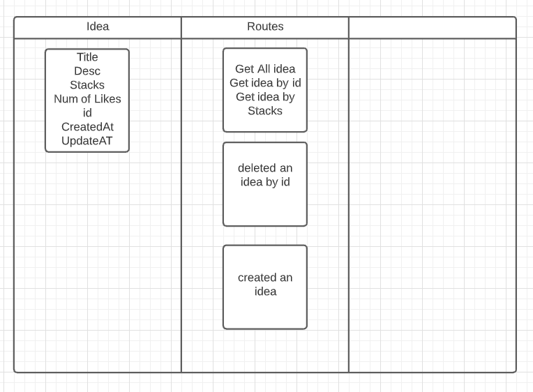
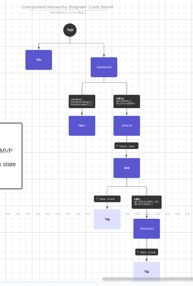
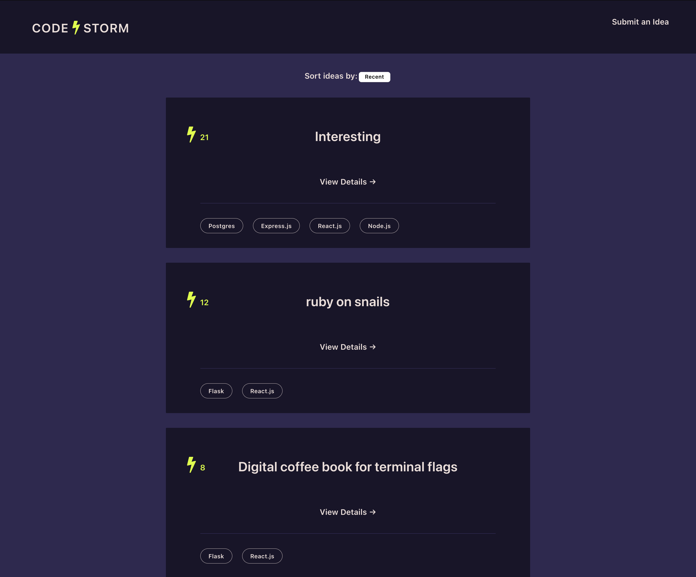

# code_storm

### Date: 9 April 2021 

*** 
Owner
* Christina Padilla:
[GitHub](https://github.com/hipstina) | 
[LinkedIn](https://www.linkedin.com/in/hipstina/)
* Nick Williams:
[GitHub](https://github.com/NickWill24) | 
[LinkedIn](https://www.linkedin.com/in/nickwill24/)

***
#### ***Description***
CodeStorm is a flask, redux, and react full stack application 

***
### ***Technologies***
* Flask
* React 
* Redux

***
### ***Future Updates***
- [ ] let user create their own stack tags 
- [ ] fitler idea by stacks
- [ ] add comments 
- [ ] Add auth

*** 
### ***Credit***

* TBD
